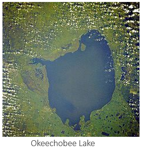

# Water-Based-Indices-on-Sentinel-2A-Images-using-Python

## Description 

This is an explortion of automatic feature detection in satellite imagery, using Python and the opensource remote sensing available in Python. Rasterio, Geospatial Data Abstraction Library, geopandas, shapely are some of the many such libraries which are used in the development of this model. 

## Objective 

This is a detailed study in itself, with the overall objective of **comparing the nature of water bodies and the surrounding areas using various water quality indices, and finally conclude the behaviour of each index.**

Further, the sub-objectives are as listed below: 
- To explore various temporal datasets
- Setting up a highly customized sentinel API in Python to download datasets
- To perform sub-pixel discrete kernel processing for implementing the indices on the rasters
- To analyze and validate the kernal performances using [QGIS](https://www.qgis.org/en/site/)

## Study Sites

- Chilikha Lagoon, Orissa, India


This is a partly inland water body located towards the North Eastern India, which is amongst world's largest brackish lagoons. It also happens to be one of the most frequent hub for Cyanoblooms. 

- Okeechobee Lake, Florida, US



Famously known as *Florida's Inland Sea*, this is the largest freshwater lake in Florida and is exceptionally shallow for its size. This site also happens to be one of the most frequent hubs for algal blooms world-wide, after the Utah lake. 

## Datasets

For this study, level 2 images from Sentinel 2A were used. The Copernicus Mission is open-source and provides the latest captures for civil use on their [Open Data Hub (Copernicus DHUS)](https://scihub.copernicus.eu/dhus/#/home).

A [python API](https://sentinelsat.readthedocs.io/en/stable/) for this platform is also available, which allows users to query the database and download products within the python script itself. 

## Results

The feature extraction kernel for water body detection in the satelite imagery outputs a single band satellite image with hues from black through white, with the most probable pixels for water bodies with higher DN values, hence highlighting them as very bright features and the rest in a darker hue.

- Chilikha Lagoon, Orissa, India


- Okeechobee Lake, Florida, US


## Contribution

Please feel free to raise issues and fix any existing ones. Further details can be found in our [code of conduct](https://github.com/Chintan2108/Water-Based-Indices-on-Sentinel-2A-Images-using-Python/blob/master/CODE_OF_CONDUCT.md).

## References

```
Bo-cai Gao, NDWI—A normalized difference water index for remote sensing of vegetation liquid water from space, Remote Sensing of Environment, Volume 58, Issue 3, 1996, Pages 257-266.
```

```
T J Malthus, A G Dekker, First Derivative Indices for the Remote Sensing of Inland Water Quality using High Spectral Resolution Reflectance, Environment International, Volume 22, Issue 2, 1995, Pages 221-232.
```

Also, a shoutout to [Abdishakur](https://towardsdatascience.com/satellite-imagery-access-and-analysis-in-python-jupyter-notebooks-387971ece84b) and [shakasom](https://gist.github.com/shakasom) for great online references and tutorials on the opensource remote sensing libraries available in the Python community.
